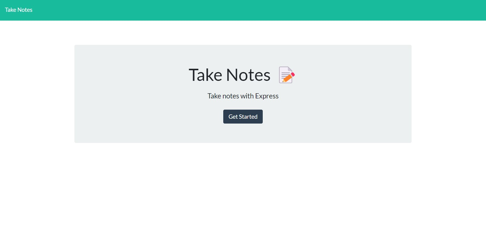

# Take Notes

## Description

A Heroku deployed application allowing user to create, save, and delete custom notes.

## Table of Contents

* [Installation](#installation)
* [Usage](#usage)
* [Contributing](#contributing)
* [Tests](#tests)
* [Questions](#questions)

## Installation

Once the project is downloaded type "npm i" into your command bar to download the neccesarry express dependecies.

## Usage

Though Heroku, [CLICK HERE](https://calm-escarpment-98969.herokuapp.com) to be brought to the application.

## Contributing

Standard practice for contribution.

## Tests

No tests at the moment.

## Questions

If you have an questions feel free to contact me via [Email](dsapione@gmail.com)
and checkout my other projects on [GitHub](https://github.com/dsapione).